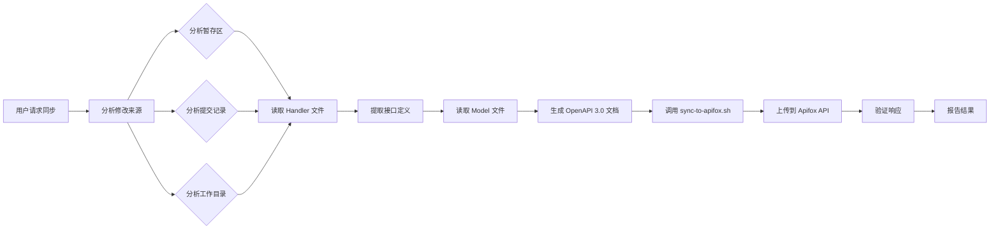

# Apifox Sync Skill

从代码中提取API接口定义，生成OpenAPI文档，并同步到Apifox平台。

## 核心逻辑

**分析 → 生成 → 同步**

1. **分析最近的修改**
   - 读取 Git 暂存区的文件
   - 分析最近的 commit 记录
   - 查看当前工作目录的修改

2. **生成 OpenAPI 文档**
   - 从 handler 文件提取接口定义
   - 从 model 文件提取数据结构
   - 生成符合 OpenAPI 3.0 标准的 JSON

3. **同步到 Apifox**
   - 使用 `scripts/sync-to-apifox.sh` 脚本
   - 调用 Apifox API 上传文档
   - 验证并报告结果

## 功能特性

✅ **智能分析** - 分析暂存区、提交记录、工作目录的变更
✅ **标准输出** - 生成符合 OpenAPI 3.0 标准的文档
✅ **一键同步** - 使用脚本直接上传到 Apifox
✅ **批量处理** - 支持同步多个模块的接口
✅ **安全保护** - 自动排除 `json:"-"` 等敏感字段

## 安装

Skill已安装在：`~/.claude/skills/apifox-sync/`

### 配置Apifox凭证

**使用交互式配置向导（推荐）**：
```bash
cd ~/.claude/skills/apifox-sync/scripts
./setup.sh
```

**或手动设置环境变量**：
```bash
export APIFOX_TOKEN="your_access_token_here"
export APIFOX_PROJECT_ID="your_project_id_here"
```

### 获取凭证

1. **Access Token**：
   - 登录Apifox Web版
   - 右上角头像 → 账户设置 → API访问令牌
   - 生成令牌并复制

2. **Project ID**：
   - 打开你的Apifox项目
   - 从URL获取：`https://app.apifox.com/project/1234567`
   - `1234567` 就是项目ID

## 使用方法

直接告诉 Claude 同步接口：

```
你: 帮我把最近的接口改动同步到 apifox
你: 上传新增的 API 到接口文档
你: 把 topic 模块的接口导入到 apifox
你: 同步暂存区的接口变更到 apifox
```

Claude 会：
1. 分析最近的修改（暂存区、提交记录、工作目录）
2. 读取 handler 和 model 文件
3. 生成 OpenAPI 3.0 文档
4. 使用脚本同步到 Apifox
5. 报告同步结果

## 典型场景

### 场景1：同步暂存区的修改
```bash
# 1. 开发完成，暂存文件
git add internal/handler/http/topic_handler.go
git add internal/model/topic.go

# 2. 让 Claude 同步
你: 帮我同步暂存区的接口到 apifox

Claude: [分析暂存的文件]
        [提取 3 个接口]
        [生成 OpenAPI 文档]
        [同步到 Apifox]
        ✅ 成功同步到 Apifox！
        • GET /api/v1/topic/list
        • GET /api/v1/topic/{topic_id}
        • DELETE /api/v1/topic/{topic_id}
```

### 场景2：同步最近的提交
```bash
# 1. 已经提交了代码
git commit -m "feat: implement user authentication"

# 2. 让 Claude 同步
你: 把最近一次 commit 的接口同步到 apifox

Claude: [分析 HEAD 提交]
        [提取变更的接口]
        [同步到 Apifox]
        ✅ 已同步 2 个接口
```

### 场景3：批量同步多个模块
```bash
你: 把 user、topic、post 模块的所有接口都同步到 apifox

Claude: [分析所有相关 handler 文件]
        [生成完整的 OpenAPI 文档]
        [批量同步]
        ✅ 成功同步 15 个接口（3 个模块）
```

## 文件结构

```
~/.claude/skills/apifox-sync/
├── SKILL.md                      # 主 Skill 文件
├── README.md                     # 使用说明
├── reference.md                  # 高级用法和 API 文档
├── VALIDATION.md                 # 验证清单
├── scripts/
│   ├── sync-to-apifox.sh        # 同步脚本（核心）
│   ├── setup.sh                 # 配置向导
│   ├── config.example.sh        # 配置示例
│   └── README.md                # 脚本使用说明
└── templates/
    └── openapi-template.json    # OpenAPI 3.0 文档模板
```

## 工作流程



## 支持的框架

| 语言 | 框架 | 支持程度 |
|------|------|---------|
| Go | Gin | ✅ 完全支持 |
| Go | Echo | ✅ 完全支持 |
| Python | FastAPI | ✅ 完全支持 |
| Python | Flask | ⚠️ 部分支持 |
| Node.js | Express | ⚠️ 部分支持 |
| Node.js | Koa | ⚠️ 部分支持 |

## 最佳实践

### 1. 使用有意义的commit message
```bash
# 好的commit message
git commit -m "feat: add topic CRUD endpoints"
git commit -m "fix: correct parameter validation in login API"

# 不好的commit message
git commit -m "update"
git commit -m "fix bug"
```

### 2. 在代码中添加注释
```go
// listTopics 获取用户创建的所有话题列表
// 返回按创建时间倒序排列的话题
func (h *topicHandler) listTopics(c *gin.Context) {
    // ...
}
```

### 3. 及时同步
- 每完成一个模块就同步一次
- 不要积累太多未同步的接口

### 4. Review生成的文档
- Claude会在项目根目录生成`*-api-import.json`
- 建议Review后再确认上传

## 常见问题

### Q: 如何触发同步？
**A**: 直接告诉 Claude："帮我同步接口到 apifox"或类似的表述即可。

### Q: 上传失败，提示401错误？
**A**: Token无效或过期，重新生成Access Token

### Q: 生成的OpenAPI文档不完整？
**A**: 可能原因：
1. 代码结构不标准
2. 缺少Model定义
3. 可以手动补充后再上传

### Q: 如何排除某些接口不同步？
**A**: 在请求时明确告诉 Claude 哪些接口不需要同步，或者在生成的 OpenAPI 文档中手动删除不需要的接口。

### Q: 支持GraphQL/gRPC吗？
**A**: 目前只支持REST API，GraphQL和gRPC需要另外的skill

## 验证Skill安装

```bash
# 检查文件是否存在
ls -la ~/.claude/skills/apifox-sync/SKILL.md

# 查看frontmatter
head -n 5 ~/.claude/skills/apifox-sync/SKILL.md

# 应该看到：
# ---
# name: apifox-sync
# description: 从代码中提取API接口定义...
# ---
```

## 调试

如果遇到问题，可以：

1. **检查生成的 OpenAPI 文档**：
```bash
cat *-openapi.json | jq '.'
```

2. **手动测试同步脚本**：
```bash
cd ~/.claude/skills/apifox-sync/scripts
./sync-to-apifox.sh --file "/path/to/openapi.json"
```

3. **验证环境变量**：
```bash
echo $APIFOX_TOKEN
echo $APIFOX_PROJECT_ID
```

## 贡献

如果你改进了这个Skill，欢迎：
1. Fork并提交PR
2. 分享给团队
3. 报告问题和建议

## 许可证

MIT License

## 更新日志

### v1.0.0 (2025-11-25)
- ✅ 初始版本
- ✅ 支持分析暂存区、提交记录、工作目录
- ✅ 支持 Go/Python/Node.js 框架
- ✅ 生成 OpenAPI 3.0 文档
- ✅ 提供 sync-to-apifox.sh 同步脚本
- ✅ 支持批量同步多个模块

---

**作者**: Created with Claude Code
**版本**: 1.0.0
**更新**: 2025-11-25
